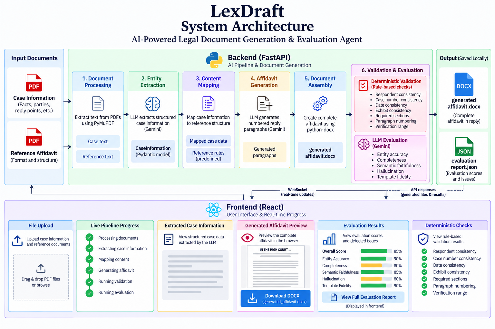

# LexDraft — AI-Powered Legal Affidavit Generation & Evaluation Agent

LexDraft is an AI agent that generates an **Affidavit in Reply** (DOCX) from a supplied
case-information PDF and a reference affidavit format, then evaluates the generated document
using both deterministic checks and an LLM-based evaluation.

This project was built as part of the **Brainwonders AI Internship** assignment.

---

## 1. Problem Statement

Drafting an Affidavit in Reply requires:

- Extracting structured case information (parties, deponent, reply points, prayer, etc.) from a case document.
- Mapping that information to the structural and linguistic conventions of a prescribed affidavit format.
- Generating the numbered body paragraphs faithfully — without introducing unsupported facts.
- Assembling a complete, correctly formatted affidavit (forum heading, cause title, deponent clause,
  numbered paragraphs, prayer, jurat, verification, and optional advocate block).
- Validating the output for structural and factual correctness.
- Evaluating the output for entity accuracy, completeness, semantic faithfulness, hallucination, and
  template fidelity.

Doing this manually is repetitive and error-prone. LexDraft automates the full pipeline
end-to-end while keeping the generated content grounded in the supplied case information.

---

## 2. Features

- **Case information extraction** — LLM extracts structured `CaseInformation` (Pydantic model) from a
  case-information PDF.
- **Content mapping** — Normalises reply points and party data for the generation stage.
- **Faithful paragraph generation** — LLM drafts only the numbered body paragraphs, constrained to
  facts explicitly present in the mapped case information.
- **Programmatic document assembly** — The prayer, jurat, verification, cause title, deponent clause,
  and advocate block are generated deterministically; only the body paragraphs come from the LLM.
- **DOCX generation** — Produces a formatted `.docx` file (Times New Roman 12 pt, 1-inch margins,
  bold/all-caps headings, right-aligned deponent, tab-stopped cause title, page break before prayer).
- **Deterministic validation** — 7 rule-based checks with a pass/fail score.
- **LLM evaluation** — 5-dimensional evaluation (entity accuracy, completeness, semantic faithfulness,
  hallucination, template fidelity) with per-criterion scores and issues.
- **Live progress** — WebSocket-based stage progress pushed to the frontend.
- **Web UI** — React frontend with file upload, live pipeline status, extracted-case display, affidavit
  preview, evaluation summary, deterministic checks, and issues section.

---

## 3. System Architecture

The system is split into a **FastAPI backend** and a **React frontend**.



> **Note:** The architecture diagram above is a placeholder. The actual diagram will be added
> separately to `docs/architecture.png`. It is not included in the current repository.

### High-level data flow

```
Case PDF ──► PyMuPDF ──► Extraction Agent (Gemini) ──► CaseInformation (Pydantic)
                                                                       │
Reference PDF ──► PyMuPDF ──► reference_text ───────────────────────────┤
                                                                       ▼
                                              reference_rules (predefined) + mapped case data
                                                                       │
                                                                       ▼
                                                        Generation Agent (Gemini)
                                                                       │
                                                                       ▼
                                              GeneratedParagraphs → Document Generator (python-docx)
                                                                       │
                                                                       ▼
                                                           generated_affidavit.docx
                                                                       │
                                              ┌────────────────────────┼────────────────────────┐
                                              ▼                        ▼                        ▼
                                     Deterministic Validators   extract_docx_text()     Evaluation Agent (Gemini)
                                              │                        │                        │
                                              ▼                        ▼                        ▼
                                     deterministic_score       generated_text         EvaluationReport (Pydantic)
                                              │                        │                        │
                                              └────────────────────────┼────────────────────────┘
                                                                       ▼
                                                           JSON response + evaluation_report.json
                                                                       │
                                                                       ▼
                                                           React frontend (display + download)
```


---

## 4. Workflow / How It Works

1. **Upload** — The user uploads a **Case Information PDF**. The reference format document
   (`01 Affidavit Format Explained.pdf`) is preloaded with the frontend and sent automatically.
2. **Extract** — PyMuPDF extracts raw text from both PDFs. The **Extraction Agent** (Gemini,
   temperature 0) converts the case text into structured `CaseInformation` JSON validated against the
   Pydantic schema.
3. **Map** — The **Content Mapper** normalises reply-point move types and flattens party/deponent
   data into a single mapped-content dictionary.
4. **Generate** — The **Generation Agent** (Gemini, temperature 0) drafts only the numbered body
   paragraphs. It receives the predefined `reference_rules` (structural/linguistic guide) and the
   mapped case information. It is explicitly prohibited from introducing unsupported facts, copying
   sample-specific details from the reference, or generating the prayer/jurat/verification.
5. **Build DOCX** — `build_affidavit_docx` assembles the full document: forum heading, jurisdiction,
   case number, cause title, affidavit title, deponent clause, numbered body paragraphs (with bold
   exhibit references), page break, programmatic prayer (a/b/c), jurat, verification, and optional
   advocate block.
6. **Validate** — 7 **deterministic checks** run against the generated DOCX text and paragraph
   metadata. A deterministic score (percentage of passed checks) is computed.
7. **Evaluate** — The **Evaluation Agent** (Gemini, temperature 0) scores the generated affidavit on
   5 dimensions and lists specific issues per dimension.
8. **Return & Persist** — The backend returns the full result as JSON and saves
   `outputs/evaluation_report.json`. The frontend displays the extracted case information, affidavit
   preview, evaluation summary, deterministic checks, and issues. The user can download the DOCX.

---

## 5. Project Structure

```
LexDraft/
├── backend/
│   ├── main.py                     # FastAPI app, REST endpoints, WebSocket, PDF extraction
│   ├── requirements.txt            # Python dependencies
│   ├── agents/
│   │   ├── extraction_agent.py     # LLM case-information extraction
│   │   ├── generation_agent.py     # LLM body-paragraph generation
│   │   └── evaluation_agent.py     # LLM 5-dimension evaluation
│   ├── core/
│   │   ├── orchestrator.py         # AffidavitOrchestrator — runs the full pipeline
│   │   ├── reference_analyzer.py   # Predefined reference_rules (structural/linguistic guide)
│   │   ├── content_mapper.py       # Maps extracted CaseInformation to generation input
│   │   ├── document_generator.py   # Builds the formatted DOCX; extracts DOCX text
│   │   └── llm_output.py           # Strips markdown fences / prose from LLM JSON output
│   ├── models/
│   │   └── schemas.py              # Pydantic models: CaseInformation, EvaluationReport, etc.
│   ├── validation/
│   │   └── validators.py           # 7 deterministic checks + score calculation
│   ├── tests_smoke.py              # Deterministic smoke test (no LLM)
│   ├── tests_result.py             # Analyses a saved /generate result
│   └── tests_visual.py             # Visual/formatting checks on the smoke-test DOCX
├── frontend/
│   ├── public/reference/
│   │   ├── 01 Affidavit Format Explained.pdf   # Preloaded reference (sent to backend)
│   │   └── 02 Affidavit in Reply Sample.docx.pdf  # Display-only sample
│   ├── src/
│   │   ├── App.tsx                 # Main app: upload, progress, results, download
│   │   ├── main.tsx                # React entry point
│   │   ├── lib/
│   │   │   ├── api.ts              # API client: generate, WebSocket, download, preloaded refs
│   │   │   ├── types.ts            # TypeScript interfaces mirroring backend schemas
│   │   │   └── utils.ts            # cn() utility (clsx + tailwind-merge)
│   │   ├── components/             # Feature components + ShadCN UI components
│   │   └── hooks/
│   │       └── use-toast.ts        # Toast hook
│   ├── package.json
│   ├── vite.config.ts              # Vite + React plugin, @ alias
│   ├── tailwind.config.js          # Tailwind + ShadCN theme
│   └── ...                         # tsconfig, eslint, postcss, components.json
├── outputs/                        # Generated artifacts (created at runtime)
│   ├── generated_affidavit.docx
│   ├── evaluation_report.json
│   ├── case_information.pdf        # Last uploaded case PDF
│   └── reference.pdf               # Last uploaded reference PDF
├── .env                            # GEMINI_API_KEY (git-ignored)
├── .env.example                    # Env-var template
└── .gitignore
```

---

## 6. Technology Stack

| Layer       | Technology                                                                 |
|-------------|----------------------------------------------------------------------------|
| Backend     | Python, FastAPI, Uvicorn                                                   |
| LLM         | Google Gemini (`gemini-3.6-flash`) via `google-genai`                       |
| PDF parsing | PyMuPDF (`pymupdf`)                                                        |
| DOCX gen    | `python-docx`                                                              |
| Validation  | Pydantic (data models), custom deterministic validators                    |
| Frontend    | React 18, TypeScript, Vite, Tailwind CSS, ShadCN UI, Lucide icons          |
| Realtime    | WebSocket (FastAPI native)                                                 |

---

## 7. Setup and Installation

### Prerequisites

- Python 3.10+
- Node.js 18+ and npm
- A valid **Google Gemini API key**

### Backend

```bash
# From the repository root
cd backend
python -m venv venv
venv\Scripts\activate      # Windows
pip install -r requirements.txt
```

### Frontend

```bash
cd frontend
npm install
```

---

## 8. Environment Variables

Create a `.env` file in the repository root (copy from `.env.example`):

```
GEMINI_API_KEY=your_api_key_here
```

| Variable        | Required | Description                     |
|-----------------|----------|---------------------------------|
| `GEMINI_API_KEY` | Yes      | Google Gemini API key           |

The backend loads this via `python-dotenv`. No other environment variables are required.

---

## 9. Running the Application

### Start the backend (terminal 1)

From the **repository root**:

```bash
uvicorn backend.main:app --reload
```

The API is available at `http://127.0.0.1:8000` (Swagger UI at `/docs`).

### Start the frontend (terminal 2)

```bash
cd frontend
npm run dev
```

The web UI is available at `http://localhost:5173`.

### Using the app

1. Open `http://localhost:5173` in your browser.
2. The reference documents are preloaded — no upload needed for them.
3. Upload a **Case Information PDF**.
4. Click **Generate Affidavit**.
5. Watch the live pipeline progress (Extract → Map → Generate → Validate → Evaluate).
6. View the extracted case information, affidavit preview, evaluation summary, deterministic checks,
   and any issues.
7. Download the generated `generated_affidavit.docx`.


---

## 10. Generated Outputs

| File                                      | Description                                              |
|-------------------------------------------|----------------------------------------------------------|
| `outputs/generated_affidavit.docx`        | The generated Affidavit in Reply (formatted DOCX).       |
| `outputs/evaluation_report.json`          | LLM evaluation report (5 dimensions + overall score).    |
| `outputs/case_information.pdf`            | Last uploaded case-information PDF.                      |
| `outputs/reference.pdf`                   | Last uploaded reference PDF.                             |

The DOCX contains, in order: forum heading, jurisdiction, case number, cause title, affidavit
title, deponent clause, numbered body paragraphs, prayer (a/b/c), jurat, verification, and an
optional advocate block.

---

## 11. Evaluation and Validation

### Deterministic Validation (7 checks)

| # | Check                        | What it verifies                                                                 |
|---|------------------------------|----------------------------------------------------------------------------------|
| 1 | Respondent consistency       | Answering-respondent references use the correct respondent number.               |
| 2 | Case number consistency      | Proceeding type, case number, and year appear in the document.                   |
| 3 | Date consistency             | The supplied date (or its ordinal form, e.g. "5th day of September 2026") appears.|
| 4 | Exhibit consistency          | Every exhibit reference in the case information appears in the generated document.|
| 5 | Required sections and order  | Court, jurisdiction, case number, affidavit title, PRAYER, VERIFICATION exist in order.|
| 6 | Paragraph numbering          | Generated paragraphs are numbered continuously from 1.                           |
| 7 | Verification range           | The verification clause references the correct paragraph count.                  |

The **deterministic score** is the percentage of passed checks.

### LLM Evaluation (5 dimensions)

| Dimension               | What it measures                                                              |
|-------------------------|-------------------------------------------------------------------------------|
| Entity Accuracy         | Names, numbers, dates, organisations, exhibits are preserved accurately.      |
| Completeness            | Important case information and reply points are present.                       |
| Semantic Faithfulness   | Meaning of case information is preserved without material alteration.         |
| Hallucination           | Absence of unsupported facts, allegations, dates, documents, or legal positions.|
| Template Fidelity       | Required sections, order, title, deponent clause, prayer, jurat, verification.|

Each dimension is scored 0–100 with a list of specific issues. An overall score is also provided.

---

## 12. Design Decisions

- **Predefined reference rules** — The structural and linguistic conventions of the Affidavit in
  Reply format are encoded as a predefined `reference_rules` dictionary (`reference_analyzer.py`),
  not dynamically parsed from the reference PDF on every request. This makes generation consistent
  and testable. The reference PDF text is still extracted and supplied to the evaluation agent.
- **Constrained generation** — Only the numbered body paragraphs are LLM-generated. The prayer,
  jurat, verification, cause title, and deponent clause are produced programmatically to guarantee
  structural correctness.
- **Faithfulness-first prompting** — The generation agent is explicitly prohibited from introducing
  unsupported facts, copying sample-specific details from the reference, or generating sections that
  are produced programmatically.
- **Dual evaluation** — Deterministic checks catch structural/factual regressions deterministically;
  the LLM evaluation catches semantic quality that rule-based checks cannot.
- **Temperature 0** — Extraction and evaluation use temperature 0 for reproducibility.
- **No external infrastructure** — Progress is tracked via in-memory WebSocket registries; no
  database or message queue is required.


---

## 13. What Is Not Implemented / Out of Scope

- **Independent legal research** — The system does not perform its own legal research or retrieve
  external authorities.
- **Para-wise replies** — The system does not draft detailed paragraph-by-paragraph replies to the
  opposing petition.
- **Dynamic reference parsing** — The reference format rules are predefined, not dynamically
  inferred from the reference PDF on each request.
- **Multi-case / batch processing** — One case is processed per generation request.
- **User authentication / authorisation** — No login, accounts, or access control.
- **Database persistence** — No long-term storage; only the latest outputs are retained.
- **Production deployment** — The application is configured for local development only.

---

## 14. Known Limitations

- Requires an internet connection and a valid Gemini API key to run.
- Generation quality depends on the underlying LLM; occasional hallucinations or omissions may occur
  and should be reviewed by a human.
- Only the **Affidavit in Reply** document type is supported.
- Only **PDF** inputs are accepted for the case information and reference documents.
- The frontend sends the preloaded `01 Affidavit Format Explained.pdf` as the reference file; the
  sample affidavit (`02 Affidavit in Reply Sample.docx.pdf`) is display-only.
- The deterministic smoke test uses mock paragraphs and does not invoke the LLM.

---

## 15. Demo / Working Link

> Live demo link: *[placeholder — add when deployed]*


---

## 16. Video Demonstration

> Video walkthrough: *[placeholder — add when recorded]*

---

## 17. AI Assistance

[ChatGPT](https://chat.openai.com) was used to assist with development, debugging, architecture and
design decisions, documentation, and implementation guidance during the build of this project. It did
not independently build or deploy the application; all design choices, integration, testing, and
final implementation were performed and validated by the author.

---

## 18. Assignment Scope / Disclaimer

This project was developed as part of the **Brainwonders AI Internship** assignment. It is a
demonstration prototype for educational purposes only. It does not constitute legal advice and is not
a substitute for review by a qualified legal professional. The generated affidavit outputs should be
verified by a human before any real-world use.

| Testing     | Custom smoke / result / visual test scripts (no LLM required for smoke)    |
